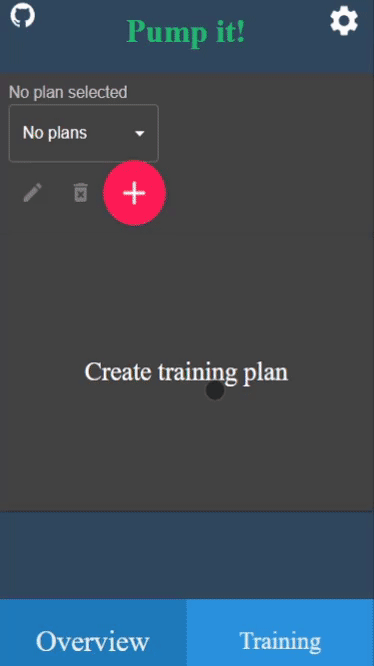

# Training App

DEMO 👉 https://train.auto200.eu/



Create your own training plans, add exercises and make your home workout easier.

Written in [Gatsby](https://github.com/gatsbyjs/gatsby/)

## Prerequisites

Written and tested on [Node.js](https://nodejs.org) version 12.16.3

## Setup

Get the code by either cloning this repository using git

```
git clone https://github.com/auto200/Training-App.git
```

... or [downloading source code](https://github.com/auto200/Training-App/archive/master.zip) code as a zip archive.

Once downloaded, open the terminal in the project directory, and install dependencies with:

```
npm install
```

---

# IMPORTANT

If you want to test your application during development on other devices in your local network, change start script in `package.json` accordingly:
`"start": "gatsby develop -H HOST_LOCAL_IP -p PORT",`
It defaults to my local ip.
If you don't care about other devices just change it like so:
`"start": "gatsby develop",`
Default port (no port specified) is 8000

Then start the app with:

```
npm run start
```

The app should now be up and running at http://localhost:8000 🚀 _if not specified otherwise_
